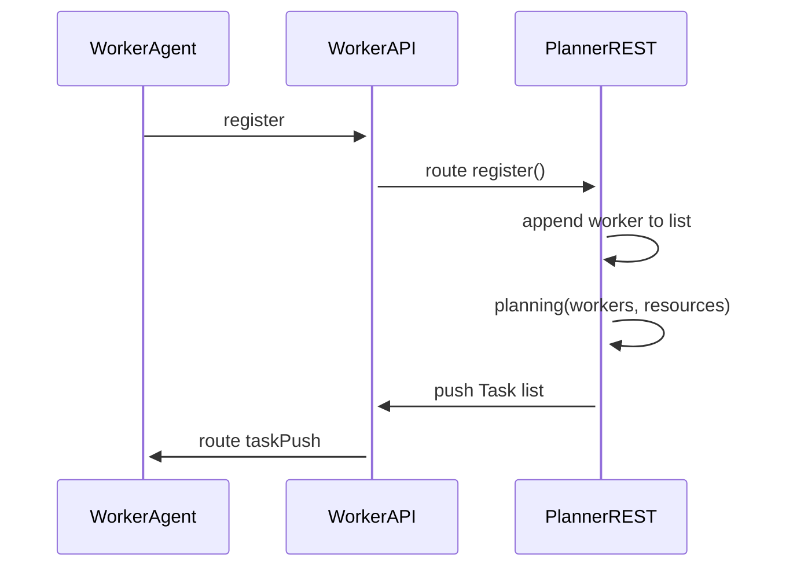
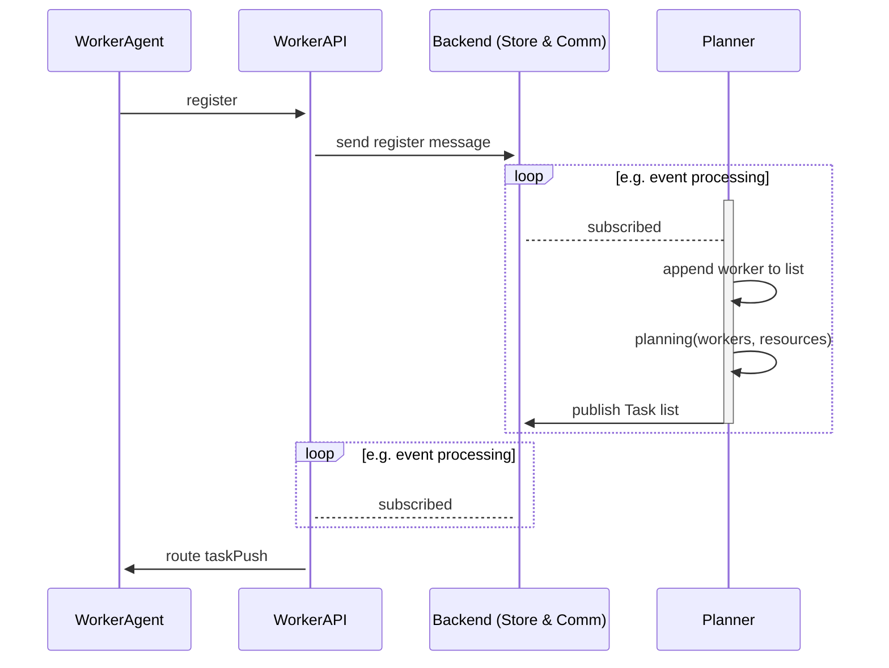
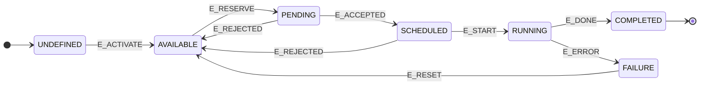

# MamoGe Taskplanner

## Architecture Idea and Design

The Main Components are `TaskPlanner`, `ProcessBoard` and the `Worker`s. There is a basic implamentation for all of them which are supposed to be used as interfaces (abstract classes) that will be implemented to allow different communication philosophies.

Sequence Diagram Business Logic:


Sequence Diagram Communication with a Flavor, e.g. a Message Queue Backend with persistance:


Task State Diagram



`
# Contributing

## Setup development environment
The `settings.json` file for `vscode` is included in the repository for a minimum of common configuration rules. When using `vscode` this means that there are specific local configuration options that have to be adopted, since the GitHub pipeline will fail otherwise.

When *not* using `vscode`, please make sure that your editor supports a *"format on save"-ish* option. Also `pre-commit` is *recommended* be utilized, see below.

**Developing with a [devcontainer 🔗](https://microsoft.github.io/code-with-engineering-playbook/developer-experience/devcontainers/).**  
When opening in vscode start the dev environment with `reopen in container`. Please also refer to the official documentation.

## Python linting and formatting

**Mandatory** packages:
- `black`

*Recommended* packages:
- `bandit`
- `flake8`
- `pycodestyle`
- `pydocstyle`

## git pre-commits

[See the official tutorial for a general introduction](https://pre-commit.com/index.html#intro) on `pre-commit`. We *recommend* to utilize `pre-commit` to ensure that all code that is pushed to the repository follows certain code quality rules. The alternative is to ensure that code is always formatted with black.

As of now, `pre-commit` is only prepared for Python code. The rules are set by `black`, [see the official documentation](https://github.com/psf/black) for more detail.

The `pre-commit` configuration (`.pre-commit-config.yaml`) has already been added to the project repository. Run the following line to use it:
```console
pre-commit install
```
> `pre-commit installed at .git/hooks/pre-commit`

Now `pre-commit` will run automatically on `git commit`.

You can check if it is working and also initialize the first use by running the following command in the project root:
```console
pre-commit run --all-files
```
